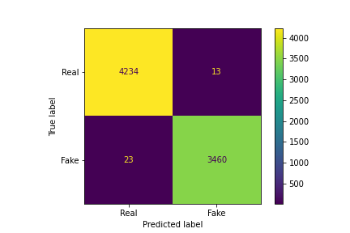

# Fake News Detection
---
title: Fake News XGBoost Classifier
author: Kamila Kolpashnikova
date: today
---

## Project Overview
Fake news became a critical problem in today’s political and social life. Disinformation continues to feed intolerance and polarize our societies. In the age of information wars and foreign meddling in domestic politics through online disinformation, it is important to develop tools and strategies for how to sift through fake and potentially harmful online content. 

In this project, I plan to build a classification model able to distinguish fake news from real ones. The project will use the XGBoost classifier model to accomplish this objective. This project is inspired by the Data Flair example  and a Medium article   on detecting Fake/Real News.

The dataset is obtained from Kaggle and contains labelled news in between 31 March 2015 and 19 February 2018. There are 44,898 articles in total, 23,481 of them fake. The distribution of fake versus real news, therefore, is balanced for this dataset (52.3% of articles is fake news). 

It contains text variables for the titles and the contents of the articles. Two other variables are also contained in the dataset: (1) the type of article and (2) the date of the article. These two were excluded from the analysis. In particular, the type of the article was excluded from the analysis because the categorization of fake news and real news did not overlap. Inclusion of this feature into a training model would bias the training outcomes. 

## Problem Statement
The objective is to build a classifier model distinguishing between fake and real news. It is a binary (0/1) classification problem. The model’s objective is to determine which news articles are fake and which are real based solely on their texts (pre-processed and vectorized). The target variable distinguishes between “fake” and “real” news.

The particular step-by-step tasks that will be achieved in the project are the following:
1.	Download and clean the fake/real news data from Kaggle: [Here is the link](https://www.kaggle.com/clmentbisaillon/fake-and-real-news-dataset)
2.	Implement two vectorizers: TF-IDF and Count Vectorizer 
3.	Test which of the two vectorizers result in better model performance with the benchmark model
4.	Train a benchmark XGBoost classifier, report its performance
5.	Tune the XGBoost model’s hyperparameters
6.	Test model performance on the test part of the data
7.	Report accuracy of the trained model

## Data

Data is from Kaggle's ['Fake and real news dataset'](https://www.kaggle.com/clmentbisaillon/fake-and-real-news-dataset)

## Results

The XGBoost Classifier model resulted in 99.53% accuracy. Here is the resulting confusion matrix:

## Repo Files
- CapstoneProject.ipynb -- contains jupyter notebook of the project results
- CapstoneProject.pdf -- description of the project and its results
- proposal.pdf -- the submitted proposal for the project
- img (folder) -- contains the figure with the final model's confusion matrix